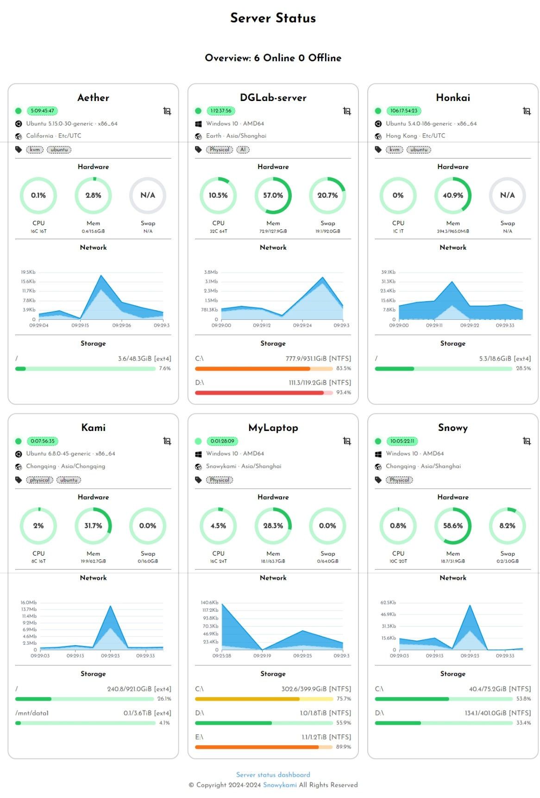

<div align="center">

# server-status-server

_✨ 服务器状态 - 服务端/后端 ✨_

</div>

## 📖 介绍

- 一个美观且简洁的服务器监控面板

- 点击查看[项目实例](https://status.liteyuki.icu/)

- 

## 💿 安装

### 从二进制文件安装

- 从 [Actions](https://github.com/snowykami/server-status-server/actions) 下载对应平台的二进制文件

## 🎉 使用

### 配置
- 默认是通过传入环境变量来配置的，你可以通过创建 `.env` 文件来或者直接传入环境变量来配置
    ```dotenv
    PORT=8080
    TOKEN=114514
    ```

### 运行
- 直接执行二进制文件即可
- 而后访问http://127.0.0.1:8888/ 即可看到效果(默认端口8888)

    ```shell
    ./server-status-server
    ```

### 监控

- 请在需要监控的服务器主机上部署客户端探针 [server-status-client](https://github.com/snowykami/server-status-client)

## 📝 其他

### 开机启动

- 手动安装请自行配置service通过systemd启动

### 自定义前端
- 前端源码在[server-status-web](https://github.com/snowykami/server-status-web)
- 接口定义请查看源代码的[api/router](./api/router.go)

### 32位系统
- 由于[cloudwego/netpoll Issue #252](https://github.com/cloudwego/netpoll/issues/252), 暂不支持32位系统
